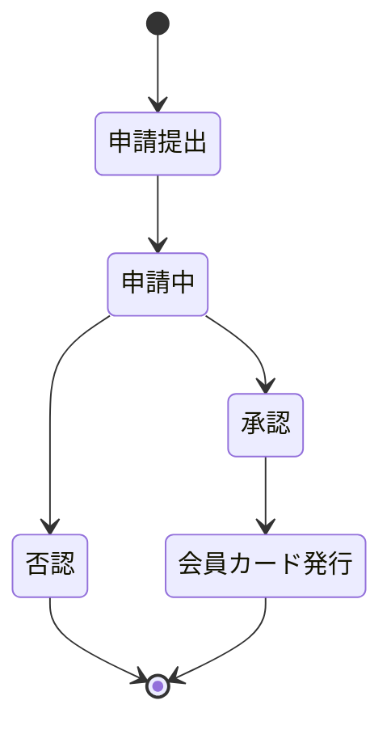
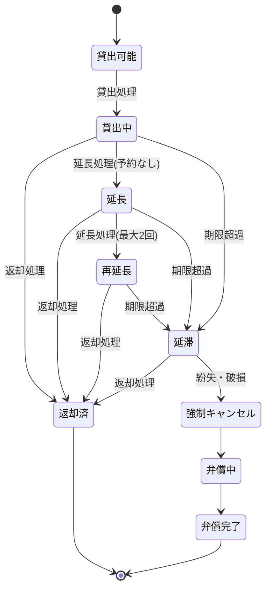
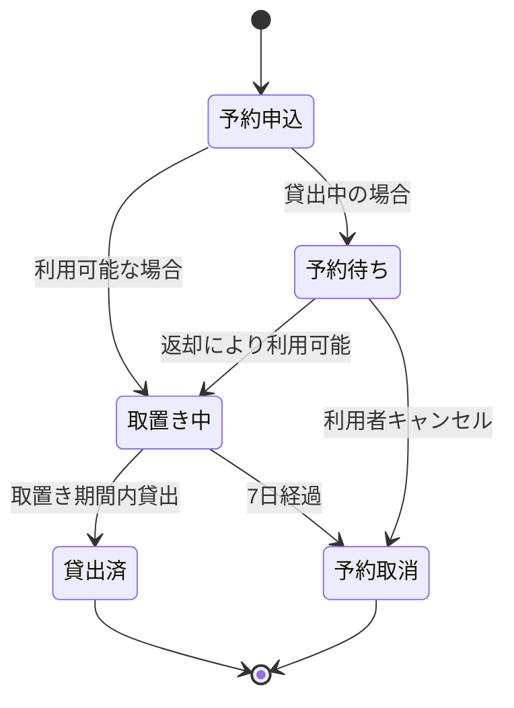
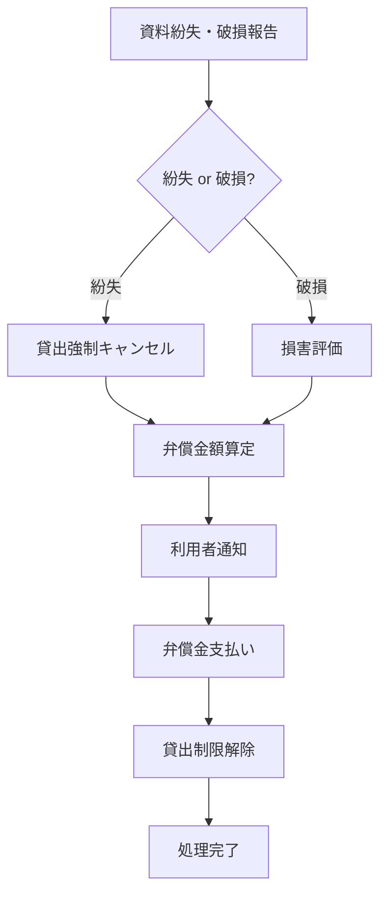
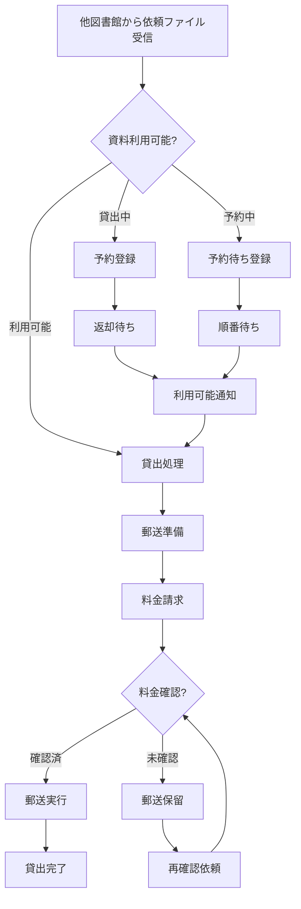

# 機能要件定義書

## 1. 利用者管理機能

### 利用者カードルール
- 貸出時に利用者カードの提示が必須
- 利用者カードは有効期限5年間
- 利用者カードのWeb申請には必要な証明書類の提示が必要

### 利用申請フロー

## 2. 貸出・返却機能

### 個人貸出ルール
- 貸出は貸出中の資料を含めて最大10冊まで
- 貸出期間は3週間
- 予約がない場合に限り、最大2回かつ2週間の延長が可能
- 返却期限を過ぎた場合に返却日から超過日数分の貸出停止処分

### 団体貸出ルール
- 団体として利用申請が必要
- 団体利用は最大100冊、貸出期間は31日とする

### 貸出状態遷移

## 3. 予約機能

### 予約ルール
- 予約は貸出中の蔵書を含めて最大10冊まで
- 予約の取置きは7日間まで
- 取置き期限を過ぎた場合は予約取り消しとなる
- 同一書誌の予約は一度に1つまで

### 予約状態遷移

## 4. 弁償機能

### 弁償ルール
- 資料を紛失、破損した場合は弁償が済むまで新規の貸出停止
- 紛失した資料は貸出を強制キャンセル

### 弁償処理フロー

## 5. 相互貸渡機能

### 相互貸渡ルール
- 別図書館からの貸出依頼を日次のファイル連携で受付可能
- 貸出期限は貸出先図書館のルールによって期限設定される
- 対象書籍が貸出中ならば予約、予約中ならば次の予約者として扱う
- 基本料金350円 + 郵送料の前納を持って郵送とする
- 連携ファイルに記載の住所（貸出先図書館または申請者の住所）に郵送する

### 相互貸渡フロー

