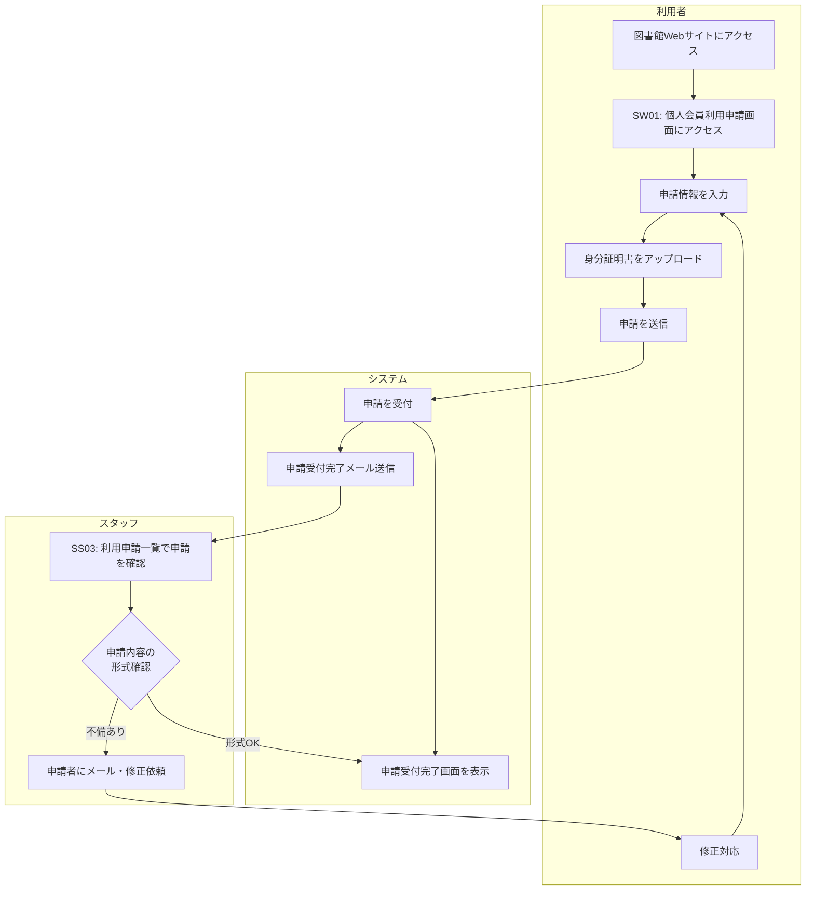

# BF001: 個人会員利用申請

## 概要
個人が図書館の利用を申請し、スタッフが受付・確認を行う業務フロー

## アクター
- **利用者**: 図書館利用を希望する個人
- **スタッフ**: 図書館職員

## 前提条件
- 利用者が図書館利用申請を行う意思がある
- 身分証明書（運転免許証、学生証等）のデジタルファイルを準備している

## 業務フロー

## 主要な判定ポイント
1. **申請情報の完整性**: 必須項目の入力確認
2. **ファイル形式の確認**: アップロードされたファイルの形式・サイズ確認
3. **申請内容の形式確認**: 明らかな入力ミスや不備の確認

## 成果物
- 利用申請レコード（利用申請テーブル）
- 個人会員利用申請提出レコード（個人会員利用申請提出テーブル）
- アップロードされた証明書ファイル

## 後続フロー
- [BF003: 利用申請承認・否認](BF003_利用申請承認・否認.md)