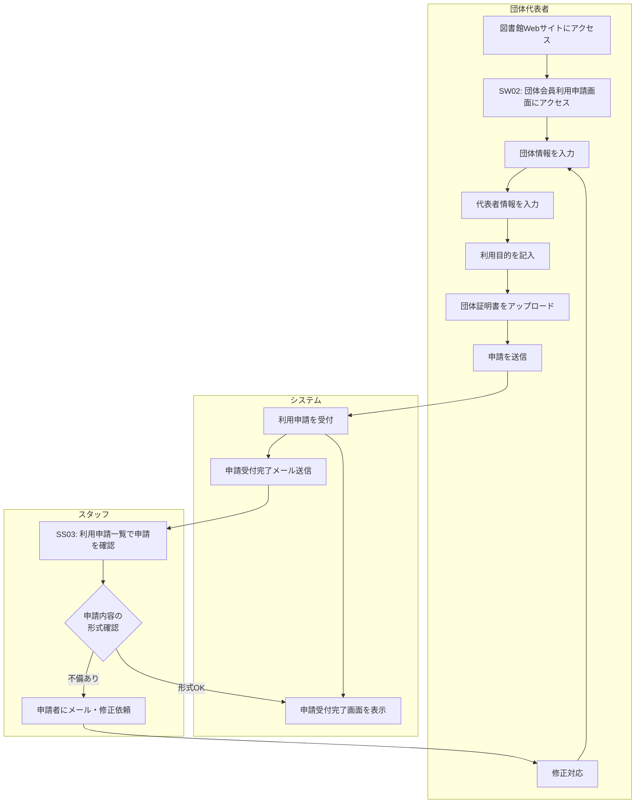

# BF002: 団体会員利用申請

## 概要
団体が図書館の利用を申請し、スタッフが受付・確認を行う業務フロー

## アクター
- **団体代表者**: 図書館利用を希望する団体の代表者
- **スタッフ**: 図書館職員

## 前提条件
- 団体が図書館利用申請を行う意思がある
- 団体証明書（登記簿謄本、設立証明書等）のデジタルファイルを準備している
- 代表者の身分証明書のデジタルファイルを準備している

## 業務フロー

## 主要な判定ポイント
1. **団体情報の完整性**: 団体名、住所、連絡先等の必須項目入力確認
2. **代表者情報の完整性**: 代表者情報の必須項目入力確認
3. **ファイル形式の確認**: アップロードされたファイルの形式・サイズ確認
4. **申請内容の形式確認**: 明らかな入力ミスや不備の確認

## 成果物
- 利用申請レコード（利用申請テーブル）
- 団体会員利用申請提出レコード（団体会員利用申請提出テーブル）
- アップロードされた団体証明書ファイル

## 後続フロー
- [BF003: 利用申請承認・否認](BF003_利用申請承認・否認.md)