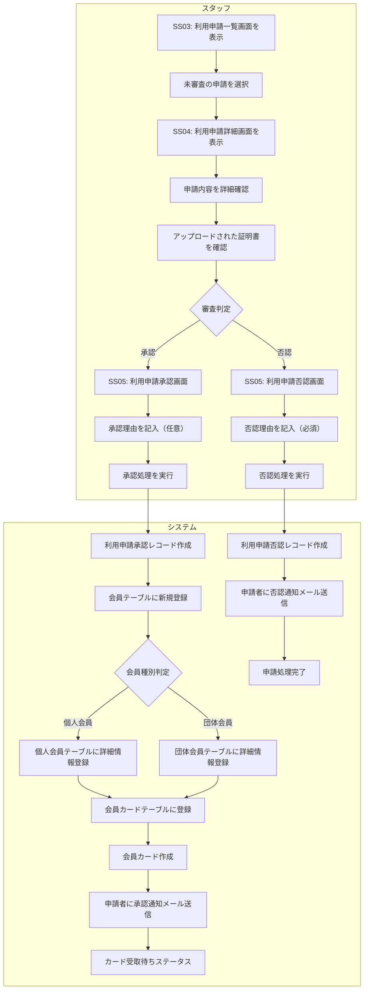

# BF003: 利用申請承認・否認

## 概要
スタッフが提出された利用申請を審査し、承認または否認の判定を行う業務フロー

## アクター
- **スタッフ**: 図書館職員（申請審査権限あり）

## 前提条件
- 利用申請が提出済み（BF001またはBF002完了）
- 申請内容と証明書の事前確認が完了している

## 業務フロー

## 審査基準

### 承認条件
1. **本人確認**: 提出された身分証明書が有効
2. **申請内容の妥当性**: 記載内容に虚偽がない
3. **利用資格**: 図書館利用規約に違反していない
4. **過去の利用履歴**: 利用停止履歴等がない（既存データベース確認）

### 否認条件
1. **証明書不備**: 身分証明書が無効または不鮮明
2. **申請内容不備**: 必須項目の未記入や虚偽記載
3. **利用資格なし**: 年齢制限、地域制限等に該当
4. **過去のトラブル**: 延滞常習、破損等の履歴あり

## 成果物

### 承認の場合
- 利用申請承認レコード（利用申請承認テーブル）
- 会員レコード（会員テーブル）
- 個人会員レコード（個人会員テーブル）または団体会員レコード（団体会員テーブル）
- 会員カードレコード（会員カードテーブル）
- 物理的な会員カード作成
- 承認通知メール

### 否認の場合
- 利用申請否認レコード（利用申請否認テーブル）
- 利用申請イベントレコード（ステータス: 否認）
- 否認通知メール（否認理由含む）

## 後続フロー

### 承認の場合
- [BF004: 会員カード交付](BF004_会員カード交付.md)

### 否認の場合
- 申請処理終了（再申請は新規申請として扱う）