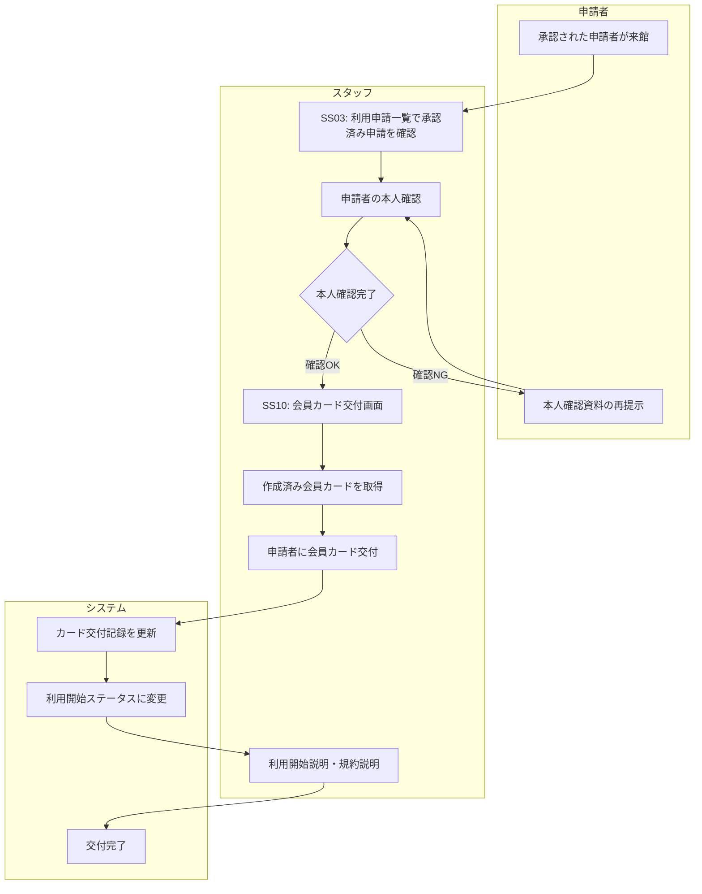

# BF004: 会員カード交付

## 概要
承認済みの申請者が来館し、事前作成された会員カードを交付する業務フロー

## アクター
- **スタッフ**: 図書館職員
- **申請者**: 承認された利用申請者

## 前提条件
- 利用申請が承認済み（BF003完了）
- 会員登録とカード作成が完了済み
- 申請者が会員カード受取のため来館している

## 業務フロー

## 会員カード仕様
- **有効期限**: 発行日から1年間
- **カード番号**: システム自動採番済み
- **記載情報**: 会員番号、氏名（団体名）、有効期限

## 成果物
- 会員カード交付記録（会員カードテーブルの交付日時更新）
- 利用開始ステータス更新（会員テーブル）
- 物理的な会員カードの交付

## 例外処理
- **本人確認失敗**: 身分証明書の再確認、必要に応じて後日再来館
- **会員カード紛失**: カード再発行手続きへ移行
- **システムエラー**: 手動記録、後日システム反映

## 注意事項
- 会員カード交付時に図書館利用規約の説明が必須
- 会員情報の変更方法について案内
- 初回ログインのためのパスワード設定方法を説明
- カードの取り扱い注意事項を説明