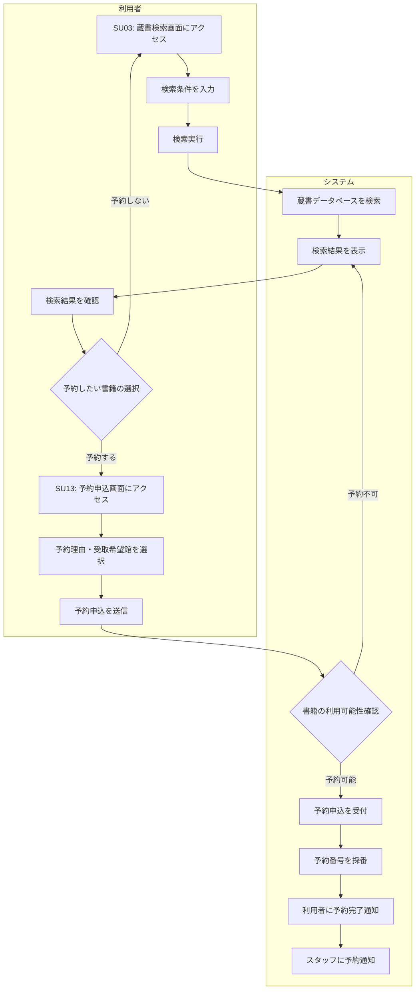

# BF005: 蔵書検索・予約申込

## 概要
利用者がオンラインで蔵書を検索し、予約可能な書籍を予約申込する業務フロー

## アクター
- **利用者**: 図書館会員

## 前提条件
- 利用者が図書館会員として登録済み
- 利用者がオンラインシステムにログイン済み

## 業務フロー

## 検索条件
1. **基本検索**: タイトル、著者名、ISBN等での検索
2. **詳細検索**: 出版年、分類、出版社等を組み合わせた検索
3. **絞り込み**: 利用可能状況、資料形態等による絞り込み

## 予約可能判定
1. **利用可能**: 書庫にあり即座に貸出可能
2. **予約可能**: 貸出中だが予約可能
3. **予約不可**: 修理中、紛失等で予約不可
4. **予約上限**: 利用者の予約上限数に達している

## 成果物
- 検索履歴レコード（検索履歴テーブル）
- 予約申込レコード（予約テーブル）
- 予約通知メール

## 後続フロー
- [BF007: 予約取置・貸出](BF007_予約取置・貸出.md)

## 例外処理
- **システムエラー**: エラーメッセージ表示、後日再試行案内
- **ログインセッション切れ**: 再ログイン案内
- **予約上限超過**: 既存予約の確認・キャンセル案内

## 注意事項
- 予約は1会員につき最大10冊まで
- 予約の有効期限は申込から30日間
- 人気書籍は予約待ちが発生する可能性がある