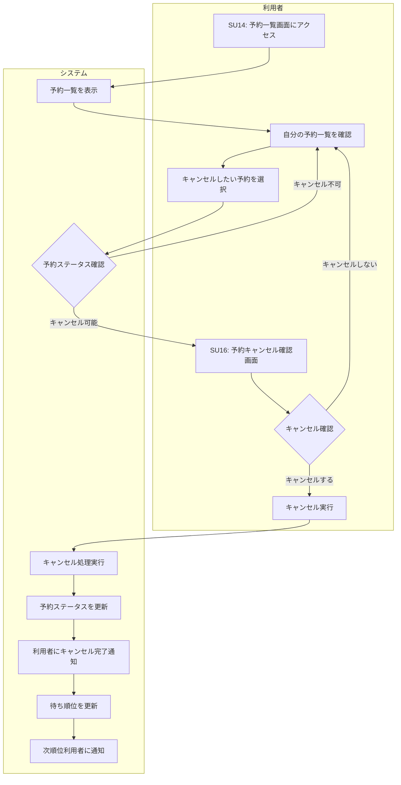

# BF006: 予約キャンセル

## 概要
利用者がオンラインで自身の予約をキャンセルする業務フロー

## アクター
- **利用者**: 図書館会員

## 前提条件
- 利用者が図書館会員として登録済み
- 利用者がオンラインシステムにログイン済み
- キャンセル対象の予約が存在する

## 業務フロー

## キャンセル可能条件
1. **予約中**: まだ取り置きされていない状態
2. **期限内**: 予約有効期限が切れていない
3. **権限確認**: 本人の予約である

## キャンセル不可条件
1. **取り置き済み**: すでに書籍が取り置きされている
2. **期限切れ**: 予約有効期限が過ぎている
3. **処理中**: 他の処理（貸出等）が進行中

## 成果物
- 予約キャンセルレコード（予約テーブルのステータス更新）
- キャンセル通知メール
- 待ち順位更新レコード

## 後続処理
- 次順位利用者への予約可能通知
- 予約待ち順位の繰り上げ

## 例外処理
- **システムエラー**: エラーメッセージ表示、後日再試行案内
- **ログインセッション切れ**: 再ログイン案内
- **同時キャンセル**: 他のユーザーが同じ書籍をキャンセルした場合の処理

## 注意事項
- キャンセル後の再予約は通常の予約申込として扱う
- 頻繁なキャンセルは利用制限の対象となる可能性がある
- 取り置き後のキャンセルは窓口での手続きが必要