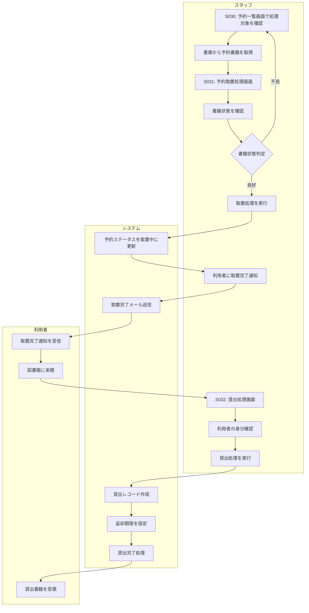

# BF007: 予約取置・貸出

## 概要
スタッフが予約書籍を書庫から取り置きし、来館者に貸出処理を行う業務フロー

## アクター
- **スタッフ**: 図書館職員
- **利用者**: 予約者

## 前提条件
- 利用者の予約が確定している
- 予約書籍が書庫に存在する

## 業務フロー

## 書籍状態判定
1. **良好**: 貸出可能な状態
2. **軽微な汚損**: 貸出可能だが注意書きが必要
3. **重度な損傷**: 修理が必要、代替書籍の検討
4. **紛失**: 在庫なし、利用者への謝罪対応

## 取置期間
- **通常**: 取置から7日間
- **遠方利用者**: 取置から14日間（郵送サービス利用者）
- **期限超過**: 自動的に次順位者に回す

## 成果物
- 予約取置レコード（予約テーブルのステータス更新）
- 取置完了通知メール
- 貸出レコード（貸出テーブル）
- 返却期限設定レコード

## 後続フロー
- [BF009: 返却処理](BF009_返却処理.md)
- [BF010: 貸出延長](BF010_貸出延長.md)

## 例外処理
- **書籍紛失**: 利用者への謝罪、代替書籍提案
- **書籍損傷**: 修理見積もり、利用者選択（待機/代替/キャンセル）
- **取置期限超過**: 次順位者への自動移行
- **利用者来館なし**: 督促通知、最終的にキャンセル

## 注意事項
- 取置期間中は他の利用者は予約不可
- 貸出時に利用者の身分証明書確認が必要
- 損傷書籍は状態詳細を記録
- 取置完了通知は速やかに送信