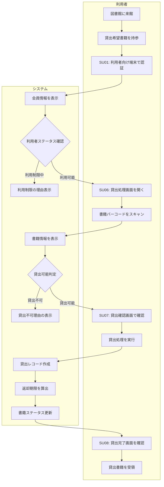

# BF008: 貸出処理

## 概要
利用者が図書館内の利用者向け端末を使用して、セルフサービスで書籍貸出を行う業務フロー

## アクター
- **利用者**: 図書館会員

## 前提条件
- 利用者が図書館会員として登録済み
- 貸出希望書籍が利用可能状態

## 業務フロー

## 利用者ステータス確認
1. **利用可能**: 正常な会員状態
2. **延滞中**: 返却期限を過ぎた書籍がある
3. **利用停止**: 長期延滞、弁償未完了等
4. **会員期限切れ**: 会員更新が必要

## 貸出可能判定
1. **書籍状態**: 貸出可能、修理中、紛失等
2. **貸出上限**: 個人10冊、団体20冊まで
3. **予約状況**: 他の利用者の予約有無
4. **特殊資料**: 貸出禁止資料の確認

## 返却期限算出
- **一般書籍**: 2週間
- **雑誌**: 1週間
- **DVD/CD**: 1週間
- **祝日調整**: 返却日が休館日の場合は翌開館日

## 成果物
- 貸出レコード（貸出テーブル）
- 書籍ステータス更新（蔵書テーブル）
- 貸出レシート（物理）

## 後続フロー
- [BF009: 返却処理](BF009_返却処理.md)
- [BF010: 貸出延長](BF010_貸出延長.md)

## 例外処理
- **会員カード忘れ**: 会員IDとパスワードでの認証
- **書籍バーコード読み取り不可**: 手入力またはISBN入力
- **システムエラー**: エラーメッセージ表示、スタッフへの連絡案内
- **利用制限中**: 制限理由の表示、スタッフカウンターへの案内

## 注意事項
- 利用者は貸出前に書籍の状態を確認
- システムが返却期限と注意事項を画面に表示
- 特殊資料（貴重書等）はセルフ貸出対象外、スタッフカウンターで手続き
- 貸出上限に達している場合は返却後の再貸出を画面で案内