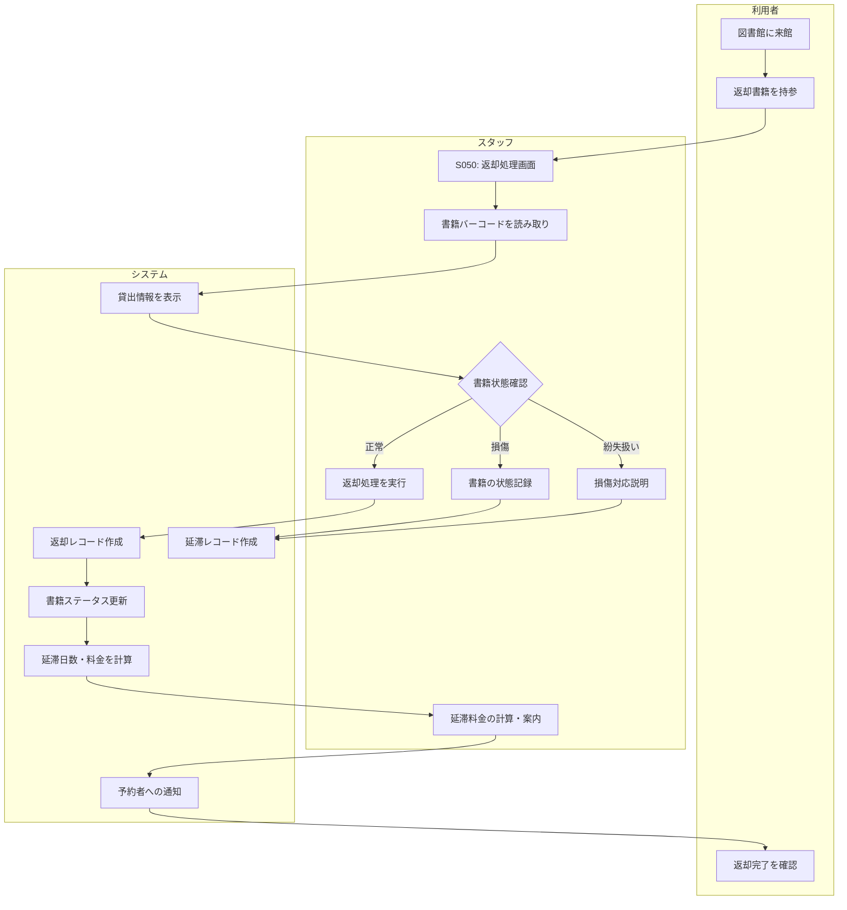

# BF009: 返却処理

## 概要
利用者が図書館窓口で書籍を返却し、スタッフが返却処理を行う業務フロー

## アクター
- **利用者**: 図書館会員
- **スタッフ**: 図書館職員

## 前提条件
- 利用者が貸出中の書籍を持参
- 返却対象書籍がシステムに登録済み

## 業務フロー

## 書籍状態確認
1. **正常**: 通常の返却処理
2. **軽微な汚損**: 注意記録、通常返却
3. **重度な損傷**: 弁償手続き必要
4. **別書籍**: 誤った書籍の返却

## 延滞料金計算
- **一般書籍**: 1日10円
- **雑誌・DVD**: 1日20円
- **上限**: 書籍代金の50%まで
- **免除**: 天災、病気等特別事情

## 成果物
- 返却レコード（返却テーブル）
- 書籍ステータス更新（蔵書テーブル）
- 延滞料金レコード（延滞テーブル）
- 予約者への取置通知

## 後続処理
- 予約者への書籍取置処理
- 損傷書籍の修理・除籍判定
- 延滞料金の徴収

## 例外処理
- **書籍バーコード読み取り不可**: 手入力またはタイトル検索
- **他館資料**: 相互貸渡返却処理に回す
- **返却期限大幅超過**: 紛失扱いから通常返却に変更
- **システムエラー**: 手書き台帳記録、後日システム反映

## 注意事項
- 返却書籍の状態を必ず確認し記録
- 延滞がある場合は利用者への説明を丁寧に
- 損傷書籍は写真撮影等で証拠保全
- 予約者がいる場合は速やかに取置処理