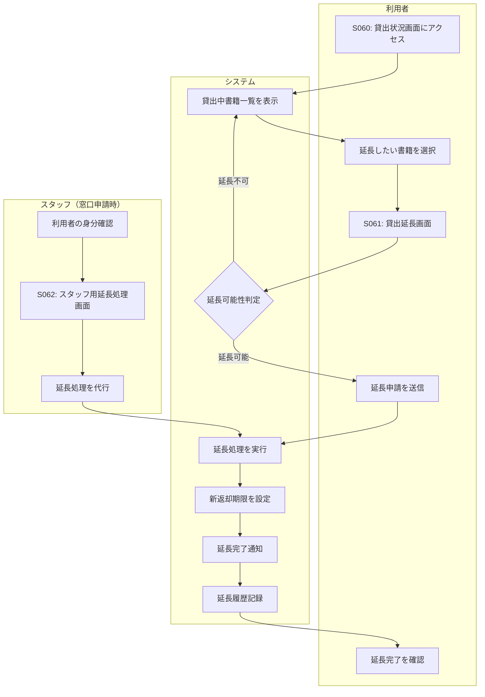

# BF010: 貸出延長

## 概要
利用者がオンラインまたは窓口で貸出期間の延長を申請する業務フロー

## アクター
- **利用者**: 図書館会員
- **スタッフ**: 図書館職員（窓口申請の場合）

## 前提条件
- 利用者が貸出中の書籍を保有
- 延長対象書籍が延長可能状態

## 業務フロー

## 延長可能判定
1. **予約なし**: 他の利用者の予約がない
2. **延長回数**: 1回まで（合計4週間）
3. **延滞なし**: 現在延滞していない
4. **期限内**: 返却期限前または当日

## 延長不可条件
1. **予約あり**: 他の利用者が予約している
2. **延長済み**: すでに1回延長している
3. **延滞中**: 返却期限を過ぎている
4. **特殊資料**: 延長禁止資料

## 新返却期限設定
- **延長期間**: 申請日から2週間
- **最大期間**: 初回貸出から4週間まで
- **祝日調整**: 返却日が休館日の場合は翌開館日
- **資料別調整**: DVD/CDは1週間のみ

## 成果物
- 延長レコード（貸出テーブルの期限更新）
- 延長履歴レコード（延長履歴テーブル）
- 延長完了通知メール

## 例外処理
- **システムエラー**: エラーメッセージ表示、窓口案内
- **同時予約**: 延長処理中に他者が予約した場合
- **ログインセッション切れ**: 再ログイン案内
- **窓口での代理申請**: 本人確認後にスタッフが代行

## 注意事項
- 延長は1回限り、回数制限に注意
- 予約者がいる場合は延長不可
- 延長後の返却期限を利用者に明確に案内
- オンライン申請は24時間受付