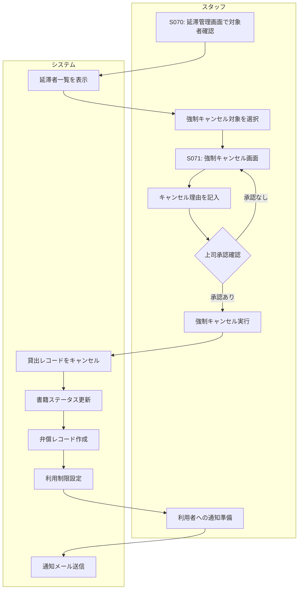

# BF011: 強制キャンセル

## 概要
スタッフが延滞等の理由で貸出を強制的にキャンセルする業務フロー

## アクター
- **スタッフ**: 図書館職員

## 前提条件
- 長期延滞または特別事情により強制処理が必要
- 管理者権限または上級スタッフの承認

## 業務フロー

## 強制キャンセル事由
1. **長期延滞**: 3ヶ月以上の延滞
2. **連絡不通**: 督促に応答なし
3. **会員資格失効**: 退職・転居等
4. **書籍紛失**: 利用者が紛失を申告

## 処理内容
1. **貸出記録**: キャンセル状態に更新
2. **書籍状態**: 紛失または要確認に設定
3. **弁償処理**: 弁償金額を算定・記録
4. **利用制限**: 一時的な利用停止

## 成果物
- 強制キャンセルレコード（貸出テーブル）
- 弁償レコード（弁償テーブル）
- 利用制限レコード（制限テーブル）
- 通知記録（通知履歴テーブル）

## 後続フロー
- [BF014: 弁償請求](BF014_弁償請求.md)

## 注意事項
- 強制キャンセルは最終手段として慎重に実施
- 必ず上司承認を得てから実行
- 利用者への丁寧な説明と謝罪が必要
- 書籍発見時の復旧手順を明確化