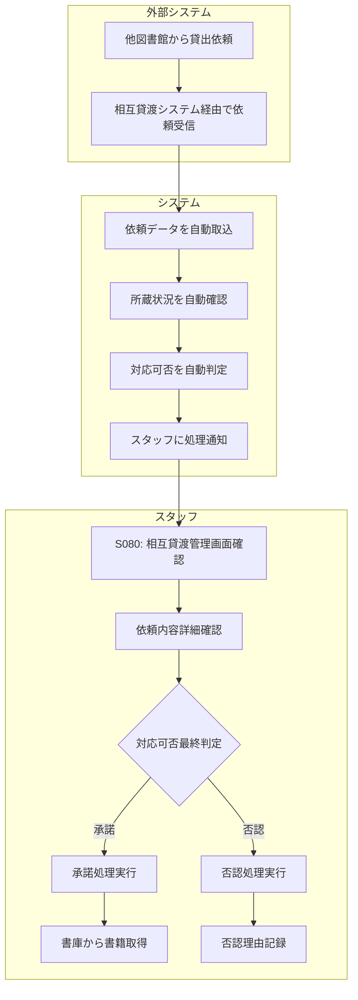

# BF012: 相互貸渡申込受付

## 概要
他図書館からの貸出依頼をシステムで受信し、スタッフが対応可否を判定する業務フロー

## アクター
- **スタッフ**: 図書館職員
- **外部システム**: 全国図書館相互貸渡システム

## 前提条件
- 相互貸渡システムとの連携が正常動作
- 対象書籍が当館に所蔵されている

## 業務フロー

## 自動判定基準
1. **所蔵あり**: 当館に該当書籍が存在
2. **利用可能**: 貸出中でない、修理中でない
3. **相互貸渡可**: 貸出禁止資料でない
4. **在庫確認**: 複本がある場合の優先順位

## スタッフ判定基準
1. **書籍状態**: 物理的な状態確認
2. **利用状況**: 館内利用頻度
3. **依頼館情報**: 過去の取引実績
4. **館内方針**: 特別コレクション等の扱い

## 成果物
- 相互貸渡受付レコード（相互貸渡テーブル）
- 書籍取置レコード（蔵書テーブル）
- 外部システムへの回答データ

## 後続フロー
- [BF013: 相互貸渡郵送](BF013_相互貸渡郵送.md)

## 例外処理
- **システム障害**: 手動での依頼確認・処理
- **書籍発見不可**: 否認処理、代替資料提案
- **依頼内容不明**: 依頼館への確認連絡

## 注意事項
- 依頼受信から24時間以内に回答
- 否認時は代替案の提示を検討
- 貴重書・特別資料は原則否認
- 相互貸渡専用の梱包材を使用