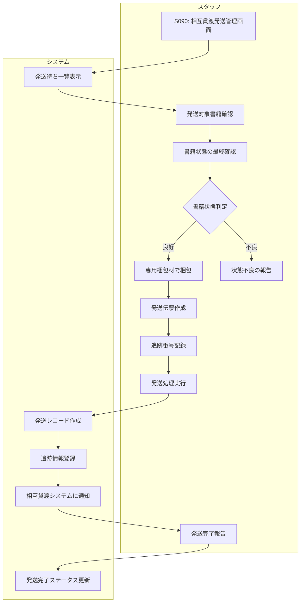

# BF013: 相互貸渡郵送

## 概要
スタッフが相互貸渡対象書籍を梱包し、依頼元図書館に郵送する業務フロー

## アクター
- **スタッフ**: 図書館職員

## 前提条件
- 相互貸渡申込が承諾済み（BF012完了）
- 対象書籍が書庫から取得済み

## 業務フロー

## 書籍状態最終確認
1. **良好**: 発送可能
2. **軽微な汚損**: 状態メモ添付で発送
3. **重度な損傷**: 発送中止、依頼館に連絡
4. **紛失**: 緊急で依頼館に謝罪連絡

## 梱包基準
1. **梱包材**: 専用ボックスまたは封筒
2. **緩衝材**: 書籍保護のための適切な緩衝
3. **防水**: ビニール袋等での防水処理
4. **表示**: 相互貸渡専用ラベル貼付

## 発送方法
- **通常**: 宅配便（追跡可能）
- **貴重**: 書留郵便
- **緊急**: 速達便
- **返却期限**: 1ヶ月後に設定

## 成果物
- 発送レコード（相互貸渡テーブル）
- 追跡番号記録
- 外部システムへの発送通知
- 発送伝票（控え）

## 例外処理
- **梱包材不足**: 購入手配、一時発送延期
- **発送業者障害**: 代替発送方法検討
- **宛先不明**: 依頼館への確認連絡

## 注意事項
- 発送前の書籍状態を写真記録
- 追跡番号は必ず記録・共有
- 発送完了は即日システム更新
- 返却期限到来前の督促準備