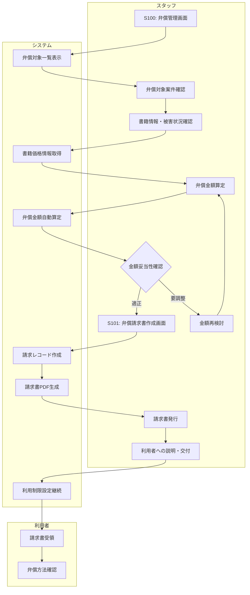

# BF014: 弁償請求

## 概要
スタッフが紛失・破損書籍の利用者に弁償金額を算定し請求書を発行する業務フロー

## アクター
- **スタッフ**: 図書館職員
- **利用者**: 弁償対象者

## 前提条件
- 書籍の紛失・破損が確定している
- 強制キャンセル処理が完了済み（BF011）

## 業務フロー

## 弁償金額算定基準
1. **新刊**: 定価の100%
2. **既刊**: 定価の70%（入手困難は100%）
3. **絶版**: 古書相場または復刻版価格
4. **破損**: 修理費用または代替購入費

## 弁償方法
1. **現金**: 窓口での現金支払い
2. **振込**: 指定口座への振込
3. **分割**: 月額制の分割払い（要相談）
4. **現物**: 同一書籍の提供（状態良好に限る）

## 成果物
- 弁償請求レコード（弁償テーブル）
- 請求書（PDF）
- 利用制限継続レコード
- 弁償説明資料

## 後続フロー
- [BF015: 弁償入金確認](BF015_弁償入金確認.md)

## 例外処理
- **価格不明**: 類似書籍価格での推定
- **特殊資料**: 専門業者査定依頼
- **利用者異議**: 上司同席での再協議
- **支払困難**: 分割払い等の相談対応

## 注意事項
- 弁償金額の算定根拠を明確に説明
- 利用者の経済状況に配慮した対応
- 請求書は複写で管理・保管
- 分割払い時は支払計画書作成