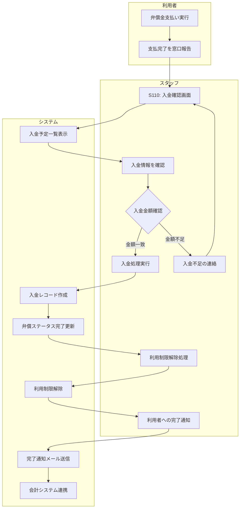

# BF015: 弁償入金確認

## 概要
スタッフが弁償金の入金をシステムで確認し、利用制限を解除する業務フロー

## アクター
- **スタッフ**: 図書館職員
- **利用者**: 弁償支払者

## 前提条件
- 弁償請求が発行済み（BF014完了）
- 利用者からの入金または現金受領

## 業務フロー

## 入金確認方法
1. **現金**: 窓口での直接受領・領収書発行
2. **振込**: 銀行口座の入金履歴確認
3. **現物**: 同一書籍の状態確認・受領
4. **分割**: 月次での入金状況確認

## 入金処理
1. **金額照合**: 請求額と入金額の突合
2. **入金日記録**: 実際の入金日時を記録
3. **支払方法記録**: 現金・振込等の方法記録
4. **領収書発行**: 正式な領収書を発行

## 利用制限解除
1. **制限解除**: 貸出・予約制限の解除
2. **履歴保持**: 弁償完了履歴は保持
3. **信用回復**: 通常の利用者として復帰
4. **注意事項**: 今後の注意喚起

## 成果物
- 入金レコード（入金テーブル）
- 弁償完了レコード（弁償テーブル）
- 利用制限解除レコード（制限テーブル）
- 領収書（現金の場合）

## 例外処理
- **入金不足**: 不足額の追加請求
- **過入金**: 差額返金手続き
- **入金遅延**: 督促連絡、分割相談
- **システムエラー**: 手動記録、後日反映

## 注意事項
- 入金確認は速やかに処理
- 領収書は法的要件を満たす様式
- 分割払いは完済まで継続管理
- 会計処理との整合性確保