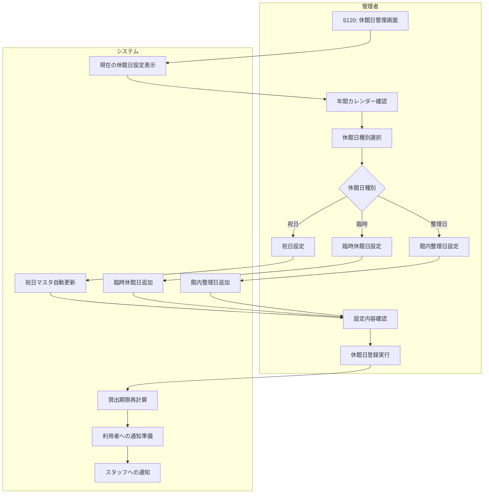

# BF016: 休館日設定

## 概要
管理者がシステムに祝日・臨時休館日を登録し、貸出期限計算に反映させる業務フロー

## アクター
- **管理者**: システム管理者または図書館長

## 前提条件
- 管理者権限でのシステムログイン
- 年間開館カレンダーの策定完了

## 業務フロー

## 休館日種別
1. **国民の祝日**: 法定祝日の自動設定
2. **年末年始**: 12/29-1/3の休館設定
3. **臨時休館**: 設備点検、イベント等
4. **館内整理日**: 月末等の定期整理日

## 設定項目
1. **休館日**: 対象日付
2. **種別**: 休館理由の分類
3. **説明**: 利用者向け説明文
4. **通知要否**: 事前通知の要否

## 影響範囲
1. **貸出期限**: 返却日が休館日の場合は翌開館日に延長
2. **予約取置**: 取置期限の自動調整
3. **延滞計算**: 休館日は延滞日数から除外
4. **システムメンテ**: 休館日でのシステム更新

## 成果物
- 休館日設定レコード（休館日テーブル）
- 貸出期限再計算結果
- 利用者通知メール
- スタッフ通知メール

## 例外処理
- **緊急休館**: 急な設備故障等での緊急設定
- **部分開館**: 一部サービスのみ休止
- **設定誤り**: 誤設定の修正・影響範囲確認

## 注意事項
- 休館日設定は最低1週間前に実施
- 既存の貸出期限への影響を確認
- 利用者への十分な事前通知
- スタッフ勤務シフトとの調整確認