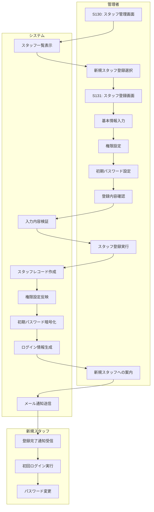

# BF017: スタッフ登録

## 概要
管理者が新規スタッフの基本情報と権限をシステムに登録する業務フロー

## アクター
- **管理者**: システム管理者または人事担当者
- **新規スタッフ**: 登録対象者

## 前提条件
- 新規スタッフの採用手続き完了
- 管理者権限でのシステムログイン

## 業務フロー

## 登録情報
1. **基本情報**: 氏名、所属、連絡先、入社日
2. **ログイン情報**: ユーザーID、初期パスワード
3. **権限設定**: 業務権限、画面アクセス権限
4. **有効期限**: アカウント有効期限

## 権限レベル
1. **一般スタッフ**: 貸出・返却・予約処理
2. **主任レベル**: 上記 + 会員管理・延滞処理
3. **管理者レベル**: 上記 + システム設定・スタッフ管理
4. **システム管理者**: 全権限

## 初期設定
1. **パスワード**: システム生成の仮パスワード
2. **権限**: 職位に応じた標準権限
3. **有効期限**: 1年後（更新可能）
4. **通知設定**: 業務通知の受信設定

## 成果物
- スタッフレコード（スタッフテーブル）
- 権限設定レコード（権限テーブル）
- ログイン情報（認証テーブル）
- 登録完了通知メール

## 後続処理
- 初回ログイン時のパスワード変更
- 業務研修・システム操作説明
- 権限テスト・動作確認

## 例外処理
- **重複ID**: 既存IDとの重複チェック・代替案提示
- **メール送信失敗**: 手動での情報提供
- **権限設定エラー**: デフォルト権限での仮登録

## 注意事項
- スタッフ情報は個人情報として厳重管理
- 初期パスワードは安全な方法で通知
- 退職時のアカウント削除手順も整備
- 権限変更時の履歴記録